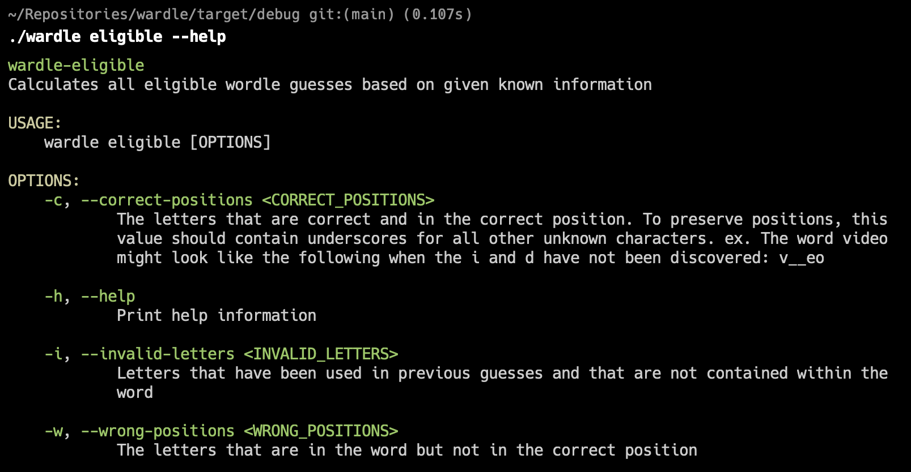
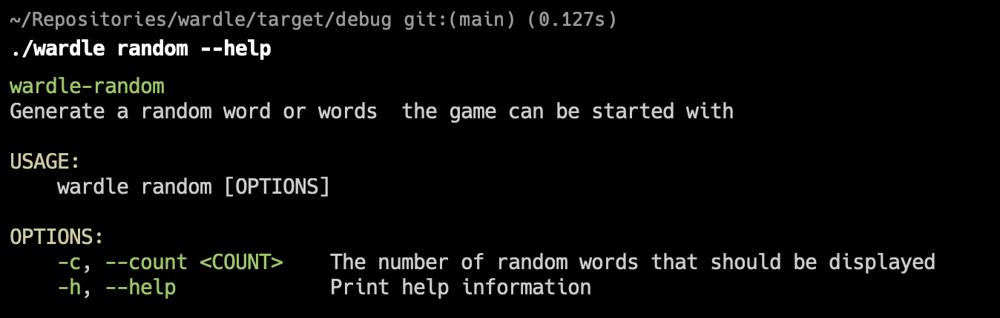

# Wardle


Fast and lightweight CLI to help you go to war against your daily wordles!

Simply provide the values you have and let wardle do the fighting.

# Build
```shell
$cargo build
$cd target/debug
```

## Eligible Options

Wardle gives you the tools to filter by over 15,000 5 letters words. Simply supply what you know about the word and let
wardle do the rest.



```shell
$ ./wardle eligible -c "sha_e" -i "wtrgicd"
$ Eligible Wordle Contenders: ["shake", "shale", "shame", "shane", "shape", "shave"]
```

## Random Word

Not sure which word to start with? Generate as many random words as you would like and pick one!



```shell
./wardle random -c 10
Randomly Selected Words: rejig, kimbo, commo, chaya, straw, brach, binit, pupil, audit, pinax
```

## Roadmap

1. Currently, Wardle does not take into account of wrong position character's index. Taking this into account will be
   useful to further cut down on the list of possible words.

